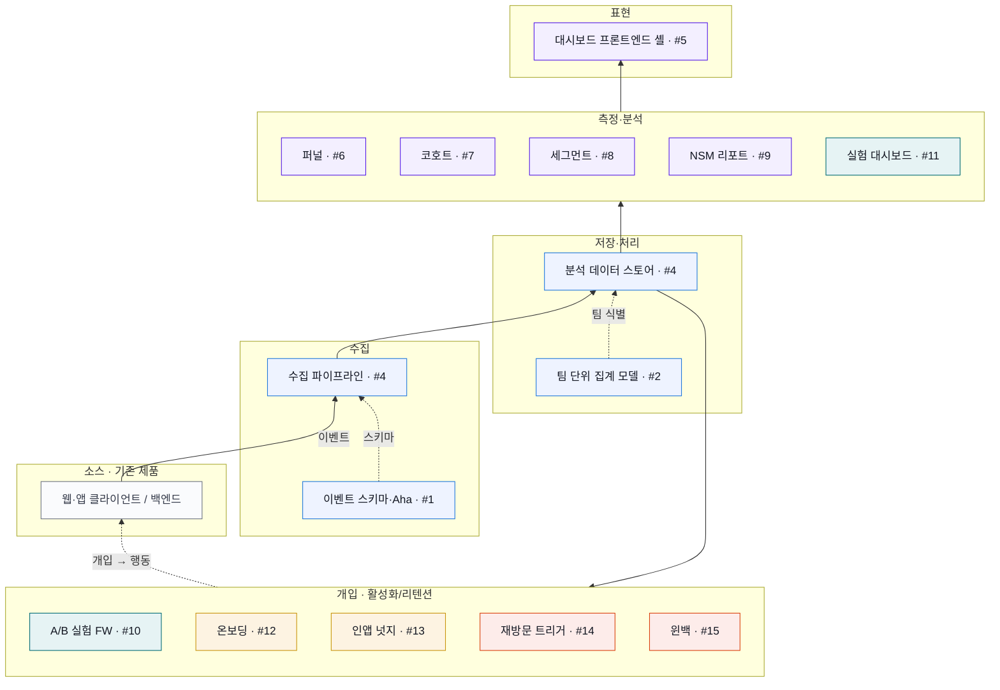

# 한빛앤(주) 플랫폼 활성화 정체 해결 프로젝트

> 한빛앤(주) 플랫폼의 활성화(Activation) 지표 정체 문제를 진단하고, 구조적으로 해결하기 위한 전략·실행 기획 저장소입니다.

## 📌 프로젝트 개요

한빛앤(주) 플랫폼은 초기 성장 이후 핵심 활성화 지표(신규 가입, 첫 핵심행동 도달, 리텐션, DAU/MAU)가 **정체 구간(Plateau)** 에 진입했습니다. 본 프로젝트는 정체의 원인을 데이터·고객·구조 관점에서 진단하고, 단기·중기·장기 실행 전략과 측정 가능한 KPI 체계를 수립하는 것을 목표로 합니다.

- **대상**: 한빛앤(주) 플랫폼
- **핵심 문제**: 플랫폼 활성화 지표 정체
- **목표**: 정체 원인 규명 → 활성화 전략 수립 → 실행 로드맵 → 성과 측정 체계 구축

## 🎯 목표 (Goals)

| 구분 | 목표 |
|------|------|
| 단기 (0~3개월) | 정체 원인 데이터 진단 완료, 핵심 퍼널 누수 지점 3곳 개선 |
| 중기 (3~6개월) | 온보딩·리텐션 구조 재설계로 활성화율 개선 |
| 장기 (6~12개월) | 자생적 성장 루프(Growth Loop) 구축, 활성 사용자 기반 안정화 |

## 📂 문서 구조

**기획 (Discovery)**

| 문서 | 내용 |
|------|------|
| [01. 문제 정의](docs/01-problem-definition.md) | 정체 문제의 범위·증상·영향 정의 |
| [02. 원인 분석](docs/02-root-cause-analysis.md) | 데이터·고객·구조 관점의 근본 원인 분석 |
| [03. 활성화 전략](docs/03-activation-strategy.md) | 단·중·장기 활성화 전략과 실험 가설 |
| [04. 실행 로드맵](docs/04-execution-roadmap.md) | 분기별 실행 계획과 책임(R&R) |
| [05. KPI / 지표 체계](docs/05-kpi-metrics.md) | 측정 지표 정의와 대시보드 설계 |
| [06. 리스크 관리](docs/06-risk-management.md) | 리스크 식별·대응 계획 |

**제품 정의 & 개발 (Delivery)**

| 문서 | 내용 |
|------|------|
| [📄 PRD](docs/PRD.md) | 심층 인터뷰 기반 제품 요구사항 정의서 (NSM·범위·요구사항) |
| [07. 개발 계획](docs/07-development-plan.md) | PRD → MVP 구현 작업 분해(5에픽/15작업) + 의존성 그래프 |
| [08. 아키텍처](docs/08-architecture.md) | 측정 우선 6계층 시스템 아키텍처 + 데이터 흐름 (SVG 다이어그램) |

## 🧭 접근 프레임워크

본 프로젝트는 **AARRR(해적 지표)** 와 **Growth Loop** 프레임워크를 기반으로 활성화(Activation) 단계에 집중합니다.

```
Acquisition → [Activation] → Retention → Referral → Revenue
                  ▲
            본 프로젝트 핵심 집중 구간
```

## 🏗 아키텍처

**측정 우선(Measurement-first) 6계층** — 기존 제품 위에 증분으로 계측·개입을 얹고, 개입이 다시 행동을 바꾸어 측정되는 Build-Measure-Learn 루프를 형성합니다. 상세: [08. 아키텍처](docs/08-architecture.md).



## 🎨 UI 목업

PRD 기반 활성화 대시보드 정적 목업(퍼널/코호트/세그먼트/실험/온보딩/리텐션 6화면). 워크스페이스/기간 필터가 실제로 수치를 재렌더하는 인터랙티브 데모입니다. → [`mockup/`](mockup/README.md) (브라우저에서 `mockup/index.html` 열기)

## 🧩 개발 진행

- **작업 분해**: [07. 개발 계획](docs/07-development-plan.md) — 5에픽 / 15작업, 측정 기반(#1~#4)이 모든 작업의 선행
- **이슈 트래킹**: [GitHub Issues #1~#15](https://github.com/pcyi-debug/hanbitn-platform-activation/issues) — 각 이슈에 작업 배경·내용·인수 조건·의존성 포함
- **마일스톤**: M1(Q1) 측정 체계 가동 + 온보딩 실험 1차 · M2(Q2) 리텐션 추세 반전

## 📘 비개발자 가이드

이 프로젝트의 기획·목업·개발 계획·아키텍처는 모두 **Claude Code와 한국어 대화만으로** 만들었습니다. 그 과정을 비개발자도 따라 할 수 있게 정리했습니다.

- [바이브 코딩 튜토리얼](tutorials/vibe-coding-tutorial.md) — 실제 사용한 프롬프트로 따라 하는 전 과정
- [Git 매뉴얼 (Claude Code 프롬프트 중심)](tutorials/git-manual-for-non-developers.md) — 명령어 없이 말로 하는 버전 관리

## 🚀 진행 방법

1. `docs/01-problem-definition.md` 부터 순서대로 검토 → [PRD](docs/PRD.md) → [개발 계획](docs/07-development-plan.md)
2. 가설 → 실험 → 측정 → 학습(Build-Measure-Learn) 사이클로 실행
3. 모든 의사결정은 KPI 대시보드 데이터 기반으로 진행

## 📝 라이선스

본 저장소는 한빛앤(주) 내부 기획 자료입니다. 외부 인용 시 출처를 명기해 주세요.
