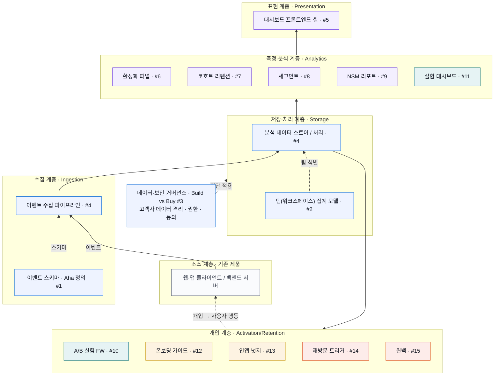
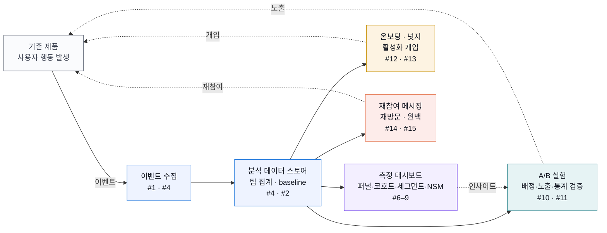

# 08. 아키텍처 문서 (Architecture)

> [PRD](PRD.md) · [개발 계획](07-development-plan.md)을 구현하기 위한 **시스템 아키텍처**.
> 설계 철학은 단 하나 — **측정 우선(Measurement-first)**. 측정 체계가 없으면 어떤 개입의 성패도 판단할 수 없으므로, 수집·저장 계층을 모든 상위 계층의 선행으로 둔다.

---

## 1. 개요

한빛앤 활성화 플랫폼은 **기존 제품 위에 증분(增分)으로 얹는 6계층 구조**다. 사용자 행동을 이벤트로 수집해 팀(워크스페이스) 단위로 적재하고, 그 데이터 위에서 측정·실험·개입을 수행한다. 개입은 다시 사용자 행동을 바꾸어 새로운 이벤트로 측정되는 **Build-Measure-Learn 루프**를 형성한다.

| 원칙 | 아키텍처 반영 |
|------|---------------|
| 측정 우선 | 수집(#1·#4)·저장(#4·#2) 계층이 대시보드·개입의 **선행 의존** |
| 팀 단위 집계 | 모든 이벤트에 `workspace_id` 부착, 팀 단위 롤업 모델(#2) |
| 증분 개선 | 소스 계층 = 기존 제품. 아키텍처 대변경 없이 계측·개입만 추가 |
| Build vs Buy | 분석 툴 도입 여부를 ADR(#3)로 먼저 결정 → 저장/표현 구현 방식 분기 |
| 데이터 거버넌스 | 고객사 데이터 격리·권한·동의를 전 계층 횡단 적용 |

## 2. 시스템 아키텍처

### 계층별 책임

| 계층 | 책임 | 구성요소 (이슈) |
|------|------|-----------------|
| **표현 (Presentation)** | 대시보드 UI, 워크스페이스/기간 필터, 권한별 데이터 노출 | 프론트엔드 셸 `#5` |
| **측정·분석 (Analytics)** | 퍼널·코호트·세그먼트·NSM 산출, 실험 통계 | `#6` `#7` `#8` `#9` `#11` |
| **개입 (Activation/Retention)** | A/B 실험 실행, 온보딩·넛지, 재참여·윈백 메시징 | `#10` `#12` `#13` `#14` `#15` |
| **저장·처리 (Storage)** | 분석 데이터 스토어, 팀 단위 집계·baseline 계산 | `#4` `#2` |
| **수집 (Ingestion)** | 이벤트 수집 파이프라인, 스키마·Aha 정의 | `#4` `#1` |
| **소스 (Source)** | 기존 제품(웹·앱 클라이언트, 백엔드)에서 행동 발생 | 기존 제품 |
| **횡단 (Cross-cutting)** | 데이터·보안 거버넌스, Build vs Buy 결정 | `#3` |

> 데이터는 소스 → 수집 → 저장 → (측정 / 개입) → 표현 순으로 **상향**하고, 개입 계층의 산출물(실험 노출·넛지·메시지)은 사용자 행동을 바꾸어 다시 소스 계층의 이벤트로 환류한다.

## 3. 데이터 흐름 (이벤트 생애주기)

1. **행동 발생** — 사용자가 기존 제품에서 행동(가입, 결과물 생성 등)을 수행.
2. **수집** — `#1`에서 정의한 스키마에 맞춰 `#4` 파이프라인이 이벤트를 수집. 모든 이벤트에 `workspace_id` 부착.
3. **적재·집계** — `#4` 데이터 스토어에 적재, `#2` 모델이 팀 단위로 롤업하고 baseline 활성화율을 계산.
4. **소비(분기)** — 동일 데이터를 ① 측정 대시보드(`#6–9`) ② A/B 실험(`#10·#11`) ③ 온보딩·넛지(`#12·#13`) ④ 재참여 메시징(`#14·#15`)이 각각 소비.
5. **환류** — 개입·실험 노출이 새로운 사용자 행동을 유발 → 1번으로 되돌아가 다시 측정.

## 4. 핵심 설계 결정 (Design Decisions)

| # | 결정 | 근거 | 관련 |
|---|------|------|------|
| D1 | **측정 계층을 단독으로 먼저 출시** | 누수 지점을 데이터로 규명해야 개입 우선순위가 정해짐 (PRD §4) | `#1`~`#9` |
| D2 | **팀(워크스페이스) 단위가 1차 집계 단위** | 활성화는 개인이 아닌 팀 단위 가치 (PRD 가정 도전 결과) | `#2` |
| D3 | **Build vs Buy를 ADR로 선결** | 퍼널/코호트/실험은 제품분석 툴 기본 기능 → 재구현 함정 회피 | `#3` |
| D4 | **개입은 반드시 A/B 프레임워크 경유** | "통계적으로 검증된 개선"이라는 성공기준 충족 | `#10`→`#12`·`#13` |
| D5 | **기존 제품 위 증분 변경만** | 소규모 인력·아키텍처 대변경 금지 (PRD 제약) | 전 계층 |

## 5. 비기능 요구사항 (Non-Functional)

| 항목 | 목표/기준 |
|------|-----------|
| **데이터 신선도** | 이벤트 수집→조회 지연 1일 이내 (`#4`) |
| **데이터 품질** | 누락·중복 모니터링 + 재처리(backfill) 경로 (`#4`) |
| **보안/프라이버시** | 고객사 데이터 격리, 워크스페이스 권한 기반 접근 제어, 수집·알림 동의 (B2B) |
| **실험 무결성** | 팀 단위 결정론적 버킷팅으로 오염(contamination) 최소화 (`#10`) |
| **메시징 컴플라이언스** | 채널별 수신 동의·빈도 제한 준수 (`#13`·`#14`) |

## 6. 계획·이슈 연계

- 마일스톤·작업 분해: [07. 개발 계획](07-development-plan.md)
- 작업별 상세(배경·내용·인수조건·의존성): [GitHub 이슈 #1~#15](https://github.com/pcyi-debug/hanbitn-platform-activation/issues)
- UI 레퍼런스: [활성화 대시보드 목업](../mockup/README.md)
- 다이어그램: 본 문서 §2·§3에 Mermaid로 인라인 작성 (GitHub에서 자동 렌더)

---

⬅️ 이전: [07. 개발 계획](07-development-plan.md) · 관련: [PRD](PRD.md) · [05. KPI 체계](05-kpi-metrics.md)
